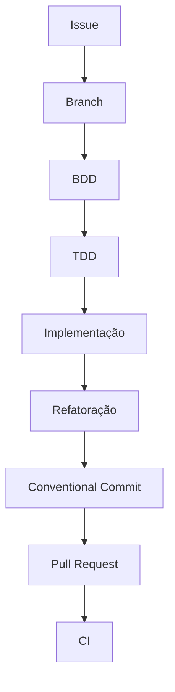
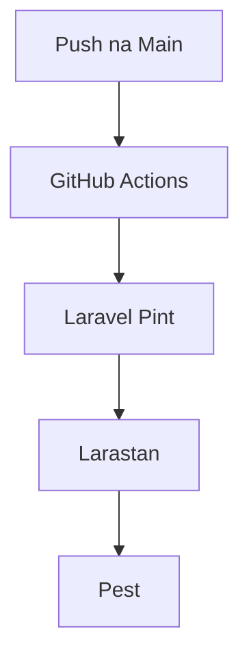

<h1 align="center">Food Delivery API</h1>

    
    

> RESTful API para um sistema de delivery desenvolvida com Laravel.
> 
> Este projeto foi criado com o objetivo de demonstrar boas práticas de desenvolvimento backend, arquitetura REST, segurança de APIs e qualidade de código, simulando um ambiente profissional de desenvolvimento.

## :book: Sobre o projeto
A Food Delivery API é uma API REST responsável pelo gerenciamento de usuários, restaurantes, produtos, carrinho de compras e pedidos de um sistema de delivery. O principal objetivo deste projeto é servir como portfólio técnico, demonstrando conhecimentos em arquitetura de software, segurança, testes automatizados e boas práticas de desenvolvimento.

## :dart: Objetivos
Este projeto foi desenvolvido para aplicar conceitos utilizados em ambientes profissionais, tais como:
- Arquitetura REST
- Clean Code
- SOLID
- Separation of Concerns (Separação de Responsabilidades)
- System Design
- Docker
- JWT Authentication
- Caching
- Queue
- OWASP API Security Top 10
- BDD (Behavior-Driven Development / Desenvolvimento Orientado a Comportamento)
- TDD (Test-Driven Development / Desenvolvimento Orientado por Testes)
- CI/CD

## :building_construction: Arquitetura
Este projeto inicialmente utilizará a arquitetura base do framework Laravel conhecida como **MVC** (Model, View, Controller) onde o Model lida com acesso aos dados, o Controller lida com requisições e respostas e a View lida com a apresentação.

## :hammer_and_wrench: Tecnologias
| Categoria | Tecnologia | 
|------------|------------| 
| Linguagem | PHP 8.5 | 
| Framework | Laravel 13 | 
| Banco de Dados | PostgreSQL | 
| Cache | Redis | 
| Containerização | Docker | 
| Ambiente | Laravel Sail | 
| Autenticação | JWT | 
| Testes | Pest | 
| Qualidade | Pint | 
| Análise Estática | Larastan (PHPStan) | 
| CI | GitHub Actions |

## :books: Princípios e Boas práticas
O projeto procura seguir as seguintes práticas:
- RESTful API
- Clean Code
- SOLID
- PSR-12
- Conventional Commits
- Github Flow
- BDD
- TDD
- Separation of Concerns
- Dependency Injection
- Validation com Form Requests
- API Resources
- Versionamento da API

## :closed_lock_with_key: Segurança
Práticas adotadas:
- JWT Authentication
- Password Hashing
- Policies
- Authorization
- Request Validation
- Rate Limiting
- Proteção contra Mass Assignment
- Princípios da OWASP API Security Top 10

## :white_check_mark: Qualidade de Código
Ferramentas utilizadas:
- Laravel Pint
- Larastan (PHPStan)
- Pest

Fluxo de desenvolvimento:

## :arrows_counterclockwise: Integração Contínua
O pipeline executa automaticamente:
- Lint (Laravel Pint)
- Análise Estática (Larastan)
- Testes Automatizados (Pest)

Fluxo:

